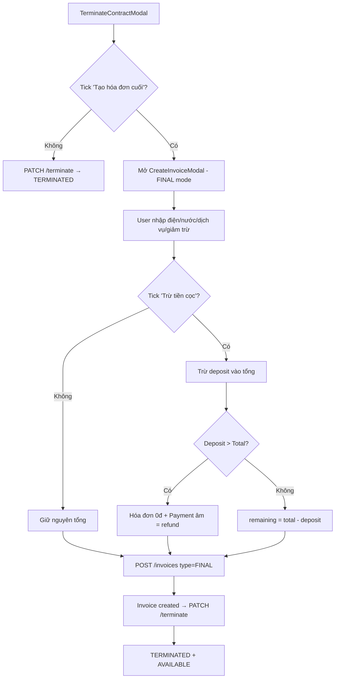

# Đóng Hợp Đồng Dài Hạn — Tạo Hóa Đơn Cuối

## Tổng quan

Khi thanh lý hợp đồng dài hạn, user có 2 lựa chọn:
1. **Tạo hóa đơn cuối → đóng** (form đầy đủ như tạo hóa đơn thường, không cần chọn kỳ thanh toán)
2. **Đóng trực tiếp** (không tạo hóa đơn)

Sau khi đóng: `TERMINATED` + Room `AVAILABLE` + Tenant `ACTIVE/CLOSED`.

---

## Luồng xử lý

---

## Proposed Changes

### 1. Backend

#### [MODIFY] [enums.ts](file:///e:/Project/room-manager/backend/src/common/constants/enums.ts)
- Thêm `DEPOSIT_DEDUCTION = 'DEPOSIT_DEDUCTION'` vào `PaymentMethod` enum

#### [MODIFY] [contracts.module.ts](file:///e:/Project/room-manager/backend/src/modules/contracts/contracts.module.ts)
- Import `Payment, PaymentSchema` vào `MongooseModule.forFeature`

#### [MODIFY] [contracts.service.ts](file:///e:/Project/room-manager/backend/src/modules/contracts/contracts.service.ts)
- Inject `PaymentModel` vào constructor
- `terminate()`: khi `createFinalInvoice && invoiceData`:
  1. Dùng `InvoicesService`-style logic tạo invoice `type=FINAL`
  2. Nếu `applyDeposit`:
     - `deposit <= total` → tạo payment `DEPOSIT_DEDUCTION`, update invoice `paidAmount/remainingAmount`
     - `deposit > total` → invoice `paidAmount=total`, `remaining=0`, tạo payment âm `amount = -(deposit - total)` kèm notes "Hoàn cọc"
  3. Terminate contract (existing logic)

#### [MODIFY] [invoice.dto.ts](file:///e:/Project/room-manager/backend/src/modules/invoices/dto/invoice.dto.ts)
- `CreateInvoiceDto`: cho phép `invoiceType = FINAL`
- Nếu `FINAL` → skip validation billing period (auto = current month)

#### [MODIFY] [invoices.service.ts](file:///e:/Project/room-manager/backend/src/modules/invoices/invoices.service.ts)
- Khi `invoiceType = FINAL` → skip billing period validation (1b, 1c)
- Không cập nhật `nextPaymentDate` cho FINAL invoice

---

### 2. Frontend

#### [MODIFY] [TerminateContractModal.tsx](file:///e:/Project/room-manager/frontend/src/components/TerminateContractModal.tsx)
- Khi tick "Tạo hóa đơn cuối" + click submit → mở `CreateInvoiceModal` ở FINAL mode
- Truyền `onSuccess` callback = gọi terminate API
- Khi không tick → gọi terminate API trực tiếp (giữ nguyên)

#### [MODIFY] [CreateInvoiceModal.tsx](file:///e:/Project/room-manager/frontend/src/components/CreateInvoiceModal.tsx)
- Thêm prop `isFinal?: boolean`
- FINAL mode:
  - Ẩn billing period picker (auto = tháng hiện tại)
  - Default `billingMonths = 1`
  - Thêm checkbox **"Trừ tiền cọc"** (hiện deposit amount của contract)
  - `invoiceType = 'FINAL'` trong payload
  - Gửi `applyDeposit: true/false` trong payload

#### [MODIFY] I18n files
- Thêm keys: `depositDeduction`, `depositDeductionDescription`, `depositRefund`

---

## Deposit Logic Detail

| Trường hợp | Ví dụ | Kết quả |
|---|---|---|
| deposit < total | Cọc 2tr, hóa đơn 5tr | paidAmount=2tr, remaining=3tr |
| deposit = total | Cọc 5tr, hóa đơn 5tr | paidAmount=5tr, remaining=0, status=PAID |
| deposit > total | Cọc 5tr, hóa đơn 3tr | paidAmount=3tr, remaining=0, status=PAID + Payment âm -2tr (hoàn cọc) |

---

## Verification

- [ ] Đóng hợp đồng **không tạo hóa đơn** → TERMINATED, no new invoice
- [ ] Đóng hợp đồng **có hóa đơn cuối** → FINAL invoice created → TERMINATED
- [ ] Trừ cọc: deposit < total → partial payment applied
- [ ] Trừ cọc: deposit > total → invoice PAID + negative payment (refund)
- [ ] FINAL invoice skip billing period validation
- [ ] FINAL invoice không update nextPaymentDate
