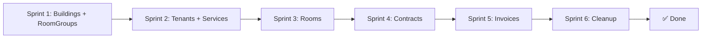

# PLAN: Chuyển Modal/Dialog → Trang Riêng

> **Mục tiêu**: Chuyển toàn bộ modal tạo/sửa/xem chi tiết thành trang riêng (route mới).  
> **Giữ nguyên**: Confirm dialog nhỏ (xóa, kích hoạt hợp đồng).  
> **Ước tính**: 6 Sprints (mỗi sprint ~1-2 ngày)

---

## Trạng Thái Hiện Tại

### Modal/Dialog cần chuyển thành trang

| # | Module | Modal hiện tại | Route mới | Loại |
|---|--------|---------------|-----------|------|
| 1 | Buildings | Dialog + BuildingForm (inline) | `/buildings/new` | Tạo mới |
| 2 | Buildings | Dialog + BuildingForm (inline) | `/buildings/:id/edit` | Chỉnh sửa |
| 3 | Rooms | Dialog + RoomForm (inline) | `/rooms/new` | Tạo mới |
| 4 | Rooms | Dialog + RoomForm (inline) | `/rooms/:id/edit` | Chỉnh sửa |
| 5 | Tenants | Dialog + TenantForm (inline) | `/tenants/new` | Tạo mới |
| 6 | Tenants | Dialog + TenantForm (inline) | `/tenants/:id/edit` | Chỉnh sửa |
| 7 | Services | Dialog + ServiceForm (inline) | `/services/new` | Tạo mới |
| 8 | Services | Dialog + ServiceForm (inline) | `/services/:id/edit` | Chỉnh sửa |
| 9 | Room Groups | Dialog + RoomGroupForm (inline) | `/room-groups/new` | Tạo mới |
| 10 | Room Groups | Dialog + RoomGroupForm (inline) | `/room-groups/:id/edit` | Chỉnh sửa |
| 11 | Contracts | ContractForm (modal) | `/contracts/new` | Tạo mới |
| 12 | Contracts | ContractForm (modal) | `/contracts/:id/edit` | Chỉnh sửa |
| 13 | Contracts | ContractViewModal | `/contracts/:id` | Xem chi tiết |
| 14 | Contracts | TerminateContractModal | `/contracts/:id/terminate` | Action |
| 15 | Invoices | ContractSelectModal + CreateInvoiceModal | `/invoices/new` | Tạo mới (flow 2 bước) |
| 16 | Invoices | CreateShortTermInvoiceModal | `/invoices/new/short-term` | Tạo mới (ngắn hạn) |
| 17 | Invoices | InvoiceViewModal | `/invoices/:id` | Xem chi tiết |
| 18 | Invoices | RecordPaymentModal | `/invoices/:id/payment` | Ghi nhận thanh toán |

### Giữ nguyên (Confirm dialogs)

| Module | Dialog | Lý do giữ |
|--------|--------|-----------|
| Buildings | Delete confirm | Confirm nhỏ, 2 nút |
| Rooms | Delete confirm | Confirm nhỏ |
| Tenants | Delete confirm | Confirm nhỏ |
| Services | Delete confirm | Confirm nhỏ |
| Room Groups | Delete confirm | Confirm nhỏ |
| Contracts | Delete confirm | Confirm nhỏ |
| Contracts | ActivateContractDialog | Confirm action |
| Invoices | Delete confirm | Confirm nhỏ |
| Payments | Delete confirm | Confirm nhỏ |

---

## Chiến Lược Kỹ Thuật

### Pattern cho trang tạo/sửa

```
pages/{module}/
├── {Module}Page.tsx           # Trang list (đã có, refactor bỏ dialog)
├── {Module}CreatePage.tsx     # [NEW] Trang tạo mới
├── {Module}EditPage.tsx       # [NEW] Trang chỉnh sửa
└── {Module}DetailPage.tsx     # [NEW] Trang xem chi tiết (nếu có)
```

### Layout cho trang tạo/sửa

```tsx
// Pattern chung cho tất cả create/edit pages
<div className="container max-w-3xl mx-auto py-6">
  {/* Breadcrumb + Back button */}
  <div className="flex items-center gap-2 mb-6">
    <Button variant="ghost" size="icon" onClick={() => navigate(-1)}>
      <ArrowLeft />
    </Button>
    <div>
      <h1 className="text-2xl font-semibold">{title}</h1>
      <p className="text-muted-foreground">{description}</p>
    </div>
  </div>

  {/* Form Card */}
  <Card>
    <CardContent className="pt-6">
      <ExistingForm
        onSubmit={handleSubmit}
        onCancel={() => navigate(-1)}
        initialData={editData}    // undefined cho create, data cho edit
        isSubmitting={isPending}
      />
    </CardContent>
  </Card>
</div>
```

### Cách tái sử dụng Form Components

Các form components hiện tại (`BuildingForm`, `RoomForm`, `TenantForm`, `ServiceForm`, `RoomGroupForm`, `ContractForm`) **giữ nguyên logic** — chỉ thay đổi nơi render (từ Dialog → Page).

### Routing Update (App.tsx)

```tsx
// Thêm routes mới
<Route path="buildings/new" element={<BuildingCreatePage />} />
<Route path="buildings/:id/edit" element={<BuildingEditPage />} />

<Route path="rooms/new" element={<RoomCreatePage />} />
<Route path="rooms/:id/edit" element={<RoomEditPage />} />

<Route path="tenants/new" element={<TenantCreatePage />} />
<Route path="tenants/:id/edit" element={<TenantEditPage />} />

<Route path="services/new" element={<ServiceCreatePage />} />
<Route path="services/:id/edit" element={<ServiceEditPage />} />

<Route path="room-groups/new" element={<RoomGroupCreatePage />} />
<Route path="room-groups/:id/edit" element={<RoomGroupEditPage />} />

<Route path="contracts/new" element={<ContractCreatePage />} />
<Route path="contracts/:id" element={<ContractDetailPage />} />
<Route path="contracts/:id/edit" element={<ContractEditPage />} />
<Route path="contracts/:id/terminate" element={<ContractTerminatePage />} />

<Route path="invoices/new" element={<InvoiceCreatePage />} />
<Route path="invoices/:id" element={<InvoiceDetailPage />} />
<Route path="invoices/:id/payment" element={<InvoicePaymentPage />} />
```

---

## Implementation Sprints

### Sprint 1: Buildings + Room Groups (đơn giản nhất)

**Files mới:**
- `pages/buildings/BuildingCreatePage.tsx`
- `pages/buildings/BuildingEditPage.tsx`
- `pages/room-groups/RoomGroupCreatePage.tsx`
- `pages/room-groups/RoomGroupEditPage.tsx`

**Files chỉnh sửa:**
- `pages/buildings/BuildingsPage.tsx` — xóa Dialog tạo/sửa, đổi nút "Add" → `navigate('/buildings/new')`, nút Edit → `navigate('/buildings/:id/edit')`
- `pages/room-groups/RoomGroupsPage.tsx` — tương tự
- `App.tsx` — thêm 4 routes

**Verification:**
- [ ] Tạo building → redirect về list
- [ ] Edit building → load data, save → redirect về list
- [ ] Nút Back hoạt động
- [ ] Delete confirm dialog vẫn hoạt động

---

### Sprint 2: Tenants + Services

**Files mới:**
- `pages/tenants/TenantCreatePage.tsx`
- `pages/tenants/TenantEditPage.tsx`
- `pages/services/ServiceCreatePage.tsx`
- `pages/services/ServiceEditPage.tsx`

**Files chỉnh sửa:**
- `pages/tenants/TenantsPage.tsx` — xóa Dialog
- `pages/services/ServicesPage.tsx` — xóa Dialog
- `App.tsx` — thêm 4 routes

**Verification:**
- [ ] CRUD hoạt động đầy đủ
- [ ] Form validation vẫn ok
- [ ] i18n hoạt động trên trang mới

---

### Sprint 3: Rooms (phức tạp hơn — có roomType logic)

**Files mới:**
- `pages/rooms/RoomCreatePage.tsx`
- `pages/rooms/RoomEditPage.tsx`

**Files chỉnh sửa:**
- `pages/rooms/RoomsPage.tsx` — xóa Dialog
- `App.tsx` — thêm 2 routes

**Lưu ý:** RoomForm có logic phức tạp (LONG_TERM vs SHORT_TERM, pricing tiers). Cần đảm bảo form render đầy đủ trên trang rộng hơn.

**Verification:**
- [ ] Tạo phòng LONG_TERM hoạt động
- [ ] Tạo phòng SHORT_TERM (hourly/daily/fixed) hoạt động
- [ ] Edit phòng load đúng data

---

### Sprint 4: Contracts (phức tạp nhất)

**Files mới:**
- `pages/contracts/ContractCreatePage.tsx`
- `pages/contracts/ContractEditPage.tsx`
- `pages/contracts/ContractDetailPage.tsx` — thay ContractViewModal
- `pages/contracts/ContractTerminatePage.tsx` — thay TerminateContractModal

**Files xóa:**
- `components/ContractViewModal.tsx` → logic chuyển vào ContractDetailPage
- `components/TerminateContractModal.tsx` → logic chuyển vào ContractTerminatePage

**Files chỉnh sửa:**
- `pages/contracts/ContractsPage.tsx` — xóa tất cả modal states, đổi sang navigate
- `App.tsx` — thêm 4 routes

**Verification:**
- [ ] Tạo hợp đồng với đầy đủ fields
- [ ] Xem chi tiết hợp đồng (trang riêng)
- [ ] Chấm dứt hợp đồng (trang riêng)
- [ ] ActivateContractDialog vẫn là confirm dialog

---

### Sprint 5: Invoices (flow phức tạp — multi-step)

**Files mới:**
- `pages/invoices/InvoiceCreatePage.tsx` — gộp ContractSelectModal + CreateInvoiceModal thành flow 2 bước trên 1 trang
- `pages/invoices/InvoiceShortTermCreatePage.tsx` — thay CreateShortTermInvoiceModal
- `pages/invoices/InvoiceDetailPage.tsx` — thay InvoiceViewModal
- `pages/invoices/InvoicePaymentPage.tsx` — thay RecordPaymentModal

**Files xóa:**
- `components/ContractSelectModal.tsx`
- `components/CreateInvoiceModal.tsx`
- `components/CreateShortTermInvoiceModal.tsx`
- `components/InvoiceViewModal.tsx`
- `components/RecordPaymentModal.tsx`

**Files chỉnh sửa:**
- `pages/invoices/InvoicesPage.tsx` — xóa tất cả modal states
- `App.tsx` — thêm 4 routes

**Flow tạo invoice (2 bước trên 1 trang):**
```
Step 1: Chọn hợp đồng (hiển thị list contracts selectable)
Step 2: Nhập chi tiết hóa đơn (render form dựa trên contract type)
```

**Verification:**
- [ ] Tạo invoice long-term (chọn contract → điền form)
- [ ] Tạo invoice short-term
- [ ] Xem chi tiết invoice
- [ ] Ghi nhận thanh toán
- [ ] Delete confirm dialog vẫn ok

---

### Sprint 6: Cleanup + Polish

**Tasks:**
- [ ] Xóa tất cả import Dialog không còn dùng trong list pages
- [ ] Xóa modal state variables (`isAddOpen`, `isEditOpen`, etc.) không còn dùng
- [ ] Thêm breadcrumb navigation thống nhất
- [ ] Test responsive trên mobile (forms full-width)
- [ ] Thêm loading skeleton cho edit pages (khi fetch data)
- [ ] Thêm 404 handling cho invalid IDs
- [ ] Update i18n keys (breadcrumb labels)
- [ ] Build test (`npm run build`)

---

## Tổng kết

| Sprint | Module | Files mới | Files sửa | Files xóa | Routes mới |
|--------|--------|-----------|-----------|-----------|------------|
| 1 | Buildings, RoomGroups | 4 | 3 | 0 | 4 |
| 2 | Tenants, Services | 4 | 3 | 0 | 4 |
| 3 | Rooms | 2 | 2 | 0 | 2 |
| 4 | Contracts | 4 | 2 | 2 | 4 |
| 5 | Invoices | 4 | 2 | 5 | 4 |
| 6 | Cleanup | 0 | ~10 | 0 | 0 |
| **Total** | | **18 files mới** | **~22 files sửa** | **7 files xóa** | **18 routes** |

---

## Agent Assignments

| Task | Agent |
|------|-------|
| Sprint 1-5 (tạo pages + refactor list pages) | `@frontend-specialist` |
| Sprint 6 (cleanup + responsive + build test) | `@frontend-specialist` |
| Design review (layout, spacing) | `@frontend-specialist` (design system) |

---

## Dependencies



> **Lưu ý**: Mỗi sprint độc lập về module. Có thể chạy S1-S3 song song nếu muốn nhanh hơn. S4 nên làm trước S5 vì Invoice phụ thuộc Contract.
