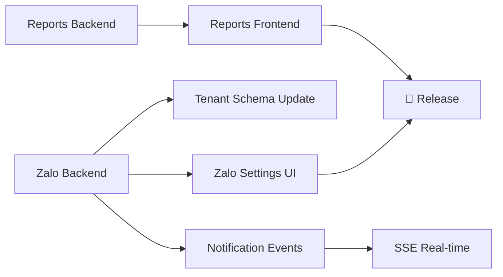

# PLAN: Reports & Zalo Integration

> **Mục tiêu**: Xây dựng hệ thống báo cáo toàn diện và tích hợp thông báo Zalo cho Room Manager.  
> **Ưu tiên**: Reports (Phase A) → Zalo Integration (Phase B)  
> **Ước tính**: 4 Sprints (mỗi sprint ~1 tuần)

---

## Trạng Thái Hiện Tại

### ✅ Đã có
- 12 backend modules hoàn chỉnh (auth → notifications)
- Notification module cơ bản (schema, controller: list/unread-count/read)
- NotificationType enum: SYSTEM, INVOICE, CONTRACT, PAYMENT, SERVICE
- Payment methods đã có ZALOPAY trong enum
- Calendar module (events, day, month-summary)
- Frontend Dashboard với RoomCard + BigCalendar

### ❌ Chưa có
- Không có module reports/statistics chuyên biệt
- Notification chưa có real-time (SSE/WebSocket)
- Chưa có Zalo OA integration
- Chưa có export PDF/Excel
- Chưa có báo cáo doanh thu, công nợ, tỉ lệ lấp phòng

---

## Phase A: Reports (Sprint 1-2)

### Sprint 1: Backend Reports Module

#### A1. Tạo Reports Module (Backend)

**File mới:**
- `backend/src/modules/reports/reports.module.ts`
- `backend/src/modules/reports/reports.controller.ts`
- `backend/src/modules/reports/reports.service.ts`
- `backend/src/modules/reports/dto/report-query.dto.ts`

**API Endpoints:**

| Method | Endpoint | Mô tả |
|--------|----------|-------|
| GET | `/api/reports/revenue` | Báo cáo doanh thu (theo tháng/quý/năm, theo building) |
| GET | `/api/reports/occupancy` | Tỉ lệ lấp phòng (theo building, theo thời gian) |
| GET | `/api/reports/debt` | Báo cáo công nợ (invoices chưa thanh toán) |
| GET | `/api/reports/tenant-stats` | Thống kê khách thuê (mới/rời/tổng, theo tháng) |
| GET | `/api/reports/service-usage` | Thống kê sử dụng dịch vụ (điện, nước...) |
| GET | `/api/reports/contract-summary` | Tổng quan hợp đồng (active/expiring/expired) |
| GET | `/api/reports/export/:type` | Export PDF/Excel (type: revenue/occupancy/debt) |

**Query Params chung:**
```
?period=monthly|quarterly|yearly
&from=2026-01-01&to=2026-03-31
&buildingId=xxx (optional, filter theo building)
```

#### A2. Revenue Report (Aggregation)

```typescript
// reports.service.ts
async getRevenueReport(ownerId: string, query: ReportQueryDto) {
  // Aggregate payments by month/building
  return this.paymentModel.aggregate([
    { $match: { ownerId, createdAt: { $gte: from, $lte: to } } },
    { $group: {
      _id: { year: { $year: '$createdAt' }, month: { $month: '$createdAt' } },
      totalRevenue: { $sum: '$amount' },
      paymentCount: { $sum: 1 },
    }},
    { $sort: { '_id.year': 1, '_id.month': 1 } },
  ]);
}
```

#### A3. Occupancy Report

```typescript
async getOccupancyReport(ownerId: string, query: ReportQueryDto) {
  const rooms = await this.roomModel.find({ ownerId, isDeleted: false });
  const occupied = rooms.filter(r => r.status === 'OCCUPIED').length;
  const total = rooms.length;
  // + historical data from contracts
}
```

#### A4. Debt Report

```typescript
async getDebtReport(ownerId: string) {
  return this.invoiceModel.aggregate([
    { $match: { ownerId, status: { $in: ['PENDING', 'PARTIAL', 'OVERDUE'] } } },
    { $lookup: { from: 'tenants', localField: 'tenantId', foreignField: '_id', as: 'tenant' } },
    { $group: { _id: '$tenantId', totalDebt: { $sum: '$remainingAmount' } } },
  ]);
}
```

### Sprint 2: Frontend Reports Pages

#### A5. Reports Dashboard Page

**Files mới:**
- `frontend/src/pages/reports/ReportsPage.tsx` — Trang chính
- `frontend/src/pages/reports/RevenueReport.tsx` — Biểu đồ doanh thu
- `frontend/src/pages/reports/OccupancyReport.tsx` — Biểu đồ lấp phòng
- `frontend/src/pages/reports/DebtReport.tsx` — Bảng công nợ
- `frontend/src/pages/reports/ExportButton.tsx` — Nút export PDF/Excel

**UI Components:**
- Charts (Recharts hoặc chart.js) — dùng chart palette từ Design System
- Date range picker cho filter thời gian
- Building selector cho filter theo tòa nhà
- Export buttons (PDF via jspdf, Excel via xlsx)

**Route mới:** `/reports` trong `App.tsx`
**Menu mới:** Icon `BarChart3` trong sidebar

#### A6. i18n Keys

Thêm translation keys cho reports module (cả vi & en).

#### A7. Verification

- [ ] API returns correct data cho mỗi report type
- [ ] Charts hiển thị đúng data
- [ ] Filter by building / time period hoạt động
- [ ] Export PDF/Excel output chính xác
- [ ] Responsive trên mobile

---

## Phase B: Zalo Integration (Sprint 3-4)

### Sprint 3: Zalo OA Setup & Backend

#### B1. Zalo OA Module (Backend)

**Prerequisite:** Đăng ký Zalo Official Account (OA) + lấy API credentials.

**Files mới:**
- `backend/src/modules/zalo/zalo.module.ts`
- `backend/src/modules/zalo/zalo.service.ts`
- `backend/src/modules/zalo/zalo.controller.ts`
- `backend/src/modules/zalo/dto/zalo.dto.ts`

**API Endpoints:**

| Method | Endpoint | Mô tả |
|--------|----------|-------|
| GET | `/api/zalo/auth-url` | Lấy URL để tenant liên kết Zalo |
| GET | `/api/zalo/callback` | OAuth callback từ Zalo |
| POST | `/api/zalo/send-message` | Gửi tin nhắn Zalo cho tenant |
| POST | `/api/zalo/send-invoice` | Gửi thông báo hóa đơn qua Zalo |
| GET | `/api/zalo/status` | Kiểm tra trạng thái kết nối Zalo OA |

#### B2. Zalo SDK Integration

```typescript
// zalo.service.ts
import axios from 'axios';

@Injectable()
export class ZaloService {
  private readonly ZALO_API = 'https://openapi.zalo.me/v3.0';
  
  async sendMessage(zaloUserId: string, message: string) {
    return axios.post(`${this.ZALO_API}/oa/message/cs`, {
      recipient: { user_id: zaloUserId },
      message: { text: message },
    }, {
      headers: { access_token: this.getAccessToken() },
    });
  }

  async sendInvoiceNotification(tenant: Tenant, invoice: Invoice) {
    const template = this.buildInvoiceTemplate(tenant, invoice);
    return this.sendMessage(tenant.zaloUserId, template);
  }
}
```

#### B3. Tenant Schema Update

Thêm field `zaloUserId` vào Tenant schema:

```typescript
// tenant.schema.ts
@Prop({ type: String, default: null })
zaloUserId: string;  // Zalo user ID (liên kết qua OAuth)

@Prop({ type: Boolean, default: false })
zaloLinked: boolean;  // Đã liên kết Zalo chưa
```

#### B4. Notification Events → Zalo

Mở rộng notification system để tự động gửi Zalo:

```typescript
// Event triggers:
// 1. Invoice created → gửi Zalo cho tenant
// 2. Invoice overdue → nhắc nhở qua Zalo
// 3. Contract expiring (7 ngày) → thông báo Zalo
// 4. Payment received → xác nhận qua Zalo
```

#### B5. Environment Variables

```env
# backend/.env
ZALO_APP_ID=your_zalo_app_id
ZALO_APP_SECRET=your_zalo_app_secret
ZALO_OA_ACCESS_TOKEN=your_oa_access_token
ZALO_WEBHOOK_SECRET=your_webhook_secret
```

### Sprint 4: Frontend Zalo & Real-time Notifications

#### B6. Zalo Settings Page (Frontend)

**Files mới:**
- `frontend/src/pages/settings/ZaloSettingsPage.tsx` — Cầu hình Zalo OA
- `frontend/src/components/ZaloLinkButton.tsx` — Nút liên kết Zalo cho tenant

**Features:**
- Hiển thị trạng thái kết nối Zalo OA
- QR code để tenant liên kết Zalo
- Cấu hình loại thông báo gửi qua Zalo (invoice, contract, payment...)
- Test gửi tin nhắn

#### B7. Real-time Notifications (SSE)

Nâng cấp notification system từ polling → Server-Sent Events:

```typescript
// notifications.controller.ts
@Sse('stream')
async streamNotifications(@CurrentUser() user): Observable<MessageEvent> {
  return this.notificationsService.getNotificationStream(user._id);
}
```

Frontend:
```typescript
// useNotifications.ts
const eventSource = new EventSource('/api/notifications/stream', {
  headers: { Authorization: `Bearer ${token}` },
});
eventSource.onmessage = (event) => {
  // Update notification count + show toast
};
```

#### B8. i18n Keys

Thêm translation keys cho Zalo module (vi & en).

#### B9. Verification

- [ ] Zalo OA liên kết thành công
- [ ] Tenant có thể liên kết Zalo của mình
- [ ] Tự động gửi thông báo Zalo khi tạo invoice
- [ ] Nhắc nhở hóa đơn quá hạn qua Zalo
- [ ] SSE real-time notifications hoạt động
- [ ] Settings page hiển thị đúng trạng thái

---

## Tổng kết Task Breakdown

| Sprint | Phase | Tasks | Ước tính |
|--------|-------|-------|---------|
| 1 | A | Backend Reports module (6 API endpoints + export) | 3-4 ngày |
| 2 | A | Frontend Reports pages (charts, filters, export) | 3-4 ngày |
| 3 | B | Zalo OA backend + tenant schema update + event triggers | 4-5 ngày |
| 4 | B | Zalo settings frontend + SSE notifications + testing | 3-4 ngày |

---

## Dependencies



---

## Agent Assignments

| Task | Agent |
|------|-------|
| A1-A4 (Reports Backend) | `@backend-specialist` |
| A5-A6 (Reports Frontend) | `@frontend-specialist` |
| B1-B5 (Zalo Backend) | `@backend-specialist` |
| B6-B8 (Zalo Frontend) | `@frontend-specialist` |
| Testing | `@debugger` |
